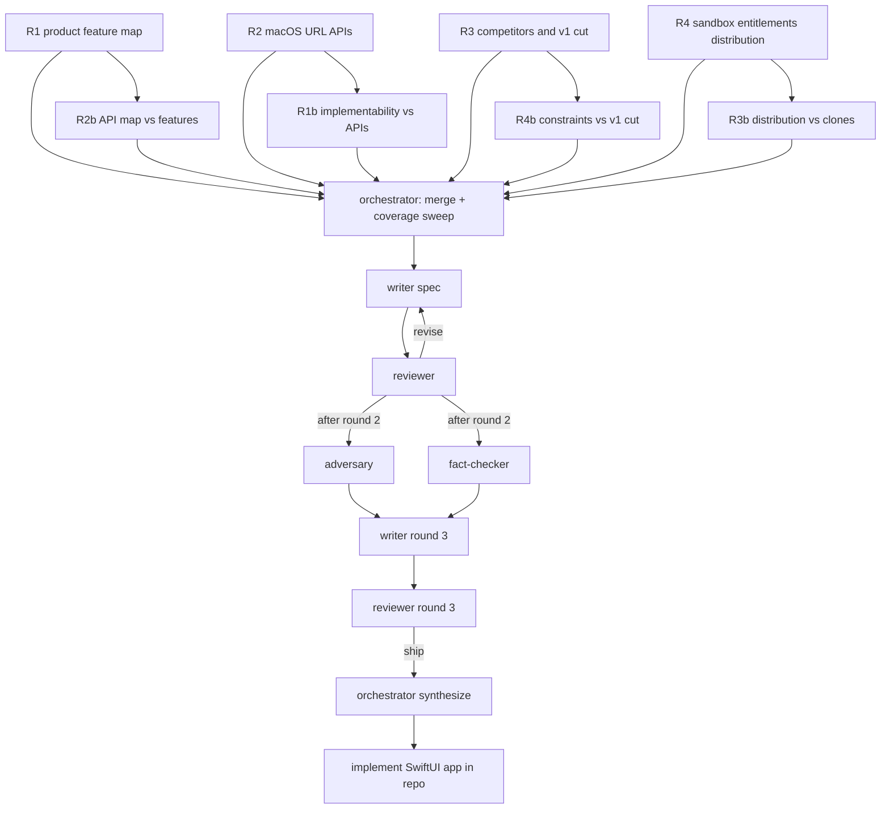

# Graph plan: Choosy-equivalent macOS app (LinkRouter)

**Run dir:** `/Users/henrik/Dev/Repos/linkrouter/.scratch/graph/20260911-1530-choosy-clone/`
**Started:** 2026-09-11 15:30
**Ask:** Research https://choosy.app/ and produce an implementation-ready spec for a native SwiftUI macOS app that does the same job: intercept links as the default browser, prompt or apply rules, and open the right browser / profile / private window. Then build that app in this repo.
**Waiver:** User pre-answered roles, depth, executor, and deliverable via the invocation form. Original request was to orchestrate the graph and make the app. Plan is presented in the orchestrator message as wave 1 fires.

## Invocation

| Dial | Value |
|---|---|
| Roles | 4 researchers (two waves), 1 writer, 1 reviewer, 1 adversary, 1 fact-checker |
| Depth | deep |
| Executor | harness subagents (`general-purpose`, inherit parent model) |
| Reviewer independence | same model family (grok-4.6). Independence is role-based: reviewer does not see writer self-assessment |
| Deliverable | `.scratch/graph/20260911-1530-choosy-clone/report.md` (~2500 words), then implement in repo root |
| Wall-clock budget | 120 minutes (deep default) |
| Node budgets | research 12 min, writing 15 min, review 10 min, adversary/fact-check 10 min |

## Depth package

- Wave 1: 4 orthogonal researchers
- Wave 2: each of the 4 extends or challenges one peer (deep peer-extension)
- Writer–reviewer: 3 revision rounds
- After round 2: adversary (two weakest claims) + fact-checker (citation re-verification)
- Output budget: ~2500 words
- Findings length override: wave 1 ~450 words, wave 2 ~300 words (10% of 2500 is too thin for an implementable macOS spec)

## Partition (wave 1)

Orthogonal, collectively exhaustive. One sub-question each. R4 is the spare angle that could invalidate the others.

| id | sub-question |
|---|---|
| R1 | What does Choosy actually do, in public docs: features, rules, prompts, profiles, extensions, API, settings, UX? |
| R2 | How does a macOS app become the default HTTP(S) handler and route a URL to a specific browser, profile, or private window? |
| R3 | What does "the same" mean for v1: competitors, Choosy pricing/positioning, must/should/defer cut? |
| R4 | What distribution, sandbox, TCC, and default-browser constraints would make a naive SwiftUI clone fail? |

## Peer-extension pairings (wave 2)

| id | depends-on | job |
|---|---|---|
| R1b | R2 | Product researcher challenges the API findings: which Choosy behaviors have no public API? |
| R2b | R1 | Platform researcher extends the feature map: each Choosy behavior → concrete API / CLI flag / entitlement, or "no public API" |
| R3b | R4 | Market researcher extends constraints: how Velja / OpenIn / others ship, and what that implies for LinkRouter |
| R4b | R3 | Constraints researcher challenges the v1 cut: which competitive features are blocked by sandbox / TCC / App Store |

## Graph

## Node table

| id | role | executor | brief | depends-on | output |
|---|---|---|---|---|---|
| R1 | researcher | harness gp | `brief-R1.md` | none | `out-R1.md` |
| R2 | researcher | harness gp | `brief-R2.md` | none | `out-R2.md` |
| R3 | researcher | harness gp | `brief-R3.md` | none | `out-R3.md` |
| R4 | researcher | harness gp | `brief-R4.md` | none | `out-R4.md` |
| R1b | researcher | harness gp | `brief-R1b.md` | R2 | `out-R1b.md` |
| R2b | researcher | harness gp | `brief-R2b.md` | R1 | `out-R2b.md` |
| R3b | researcher | harness gp | `brief-R3b.md` | R4 | `out-R3b.md` |
| R4b | researcher | harness gp | `brief-R4b.md` | R3 | `out-R4b.md` |
| MERGE | orchestrator | this session | n/a | R1–R4, R1b–R4b | `merge.md` |
| W-r1 | writer | harness gp | `brief-W.md` | MERGE | `draft-r1.md` |
| V-r1 | reviewer | harness gp | `brief-V.md` | W-r1 | `critique-r1.md` |
| W-r2 | writer | harness gp | `brief-W-r2.md` | V-r1 | `draft-r2.md` |
| V-r2 | reviewer | harness gp | `brief-V.md` | W-r2 | `critique-r2.md` |
| ADV | adversary | harness gp | `brief-ADV.md` | V-r2 | `out-ADV.md` |
| FC | fact-checker | harness gp | `brief-FC.md` | V-r2 | `out-FC.md` |
| W-r3 | writer | harness gp | `brief-W-r3.md` | V-r2, ADV, FC | `draft-r3.md` |
| V-r3 | reviewer | harness gp | `brief-V.md` | W-r3 | `critique-r3.md` |
| SYN | orchestrator | this session | n/a | last draft + ship | `report.md` |
| BUILD | orchestrator | this session | n/a | SYN | SwiftUI app in repo root |

## Review rubric

A draft ships only if the reviewer inspects **every** section against **every** point and cites the point.

1. **Answers the asked question.** The draft is a buildable spec for a Choosy-equivalent native SwiftUI macOS app named LinkRouter, not a product review of Choosy and not a generic browser-picker essay.
2. **Evidence.** Every factual claim has a source + locator (URL + access date 2026-09-11, or `file:line`). API claims cite Apple documentation or a verified browser CLI flag. The same URL appearing in three findings files is one data point.
3. **Structure.** Inline requirements (FR/NFR/CON with Must/Should/Could), then conceptual components, then a logical shape an implementer can code against, then a v1 implementation order. Headings in sentence case.
4. **Gaps.** Every Choosy public feature is either in v1, explicitly deferred with a reason, or marked "no public API / cannot ship". Silent drops fail. Invented Choosy features fail.
5. **Implementability (risk 1).** Every v1 feature names a real macOS / Swift API, entitlement, Info.plist key, or browser CLI flag, or is explicitly deferred. Hallucinated `LS*` / `NSWorkspace` methods fail this point.
6. **Independence (risk 2).** The product is LinkRouter. No Choosy name, icon, copy, or screenshot assets in the shipped app. Research is public docs, help pages, and reviews only. No reverse-engineering of Choosy binaries.

Verdict must be exactly `revise` (with numbered defects mapped to rubric points) or `ship` (citing each rubric point and naming which sections were inspected). Sampled coverage is `revise`.

## Stop conditions

Stop on the first of: reviewer `ship` on a fully inspected draft, 3 revision rounds spent, or 120 minutes wall-clock. Record which one stopped it.

## Legal / research constraints (all nodes)

- Do not download or reverse-engineer Choosy.app, its binary, or its paid resources.
- Public website, help docs, App Store listing, reviews, and Apple platform docs only.
- Do not copy Choosy UI chrome, marketing copy, or artwork into the spec as something to reproduce pixel-for-pixel. Feature-equivalent, original UI.
- Cite every claim.

## After synthesis

Implement a working macOS SwiftUI app in `/Users/henrik/Dev/Repos/linkrouter` from `report.md`. Native, modern settings window + prompt. Register as default HTTP(S) handler. Detect browsers. First-match rule engine. Profile / private-window where the platform research supports it.
