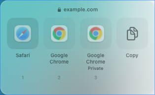
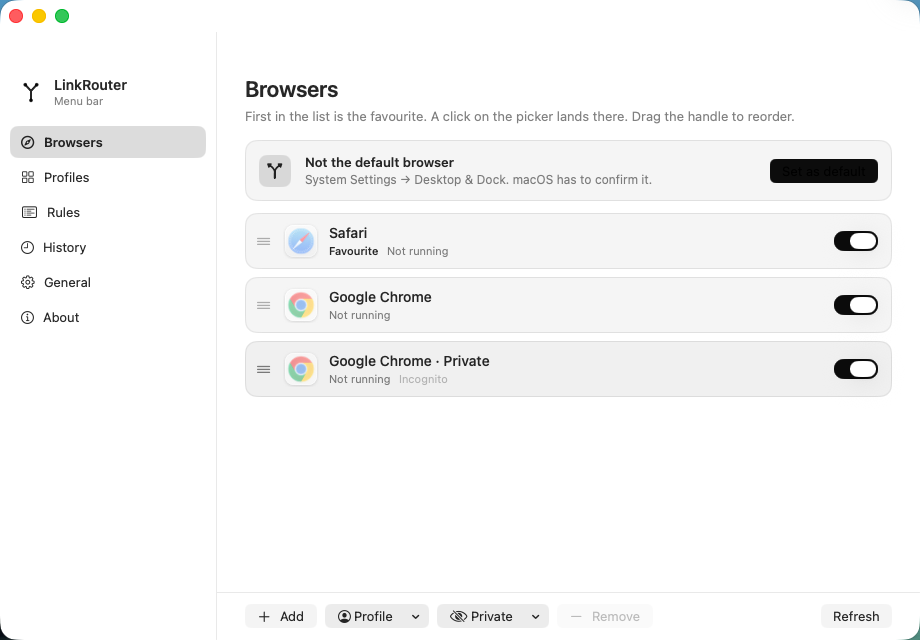
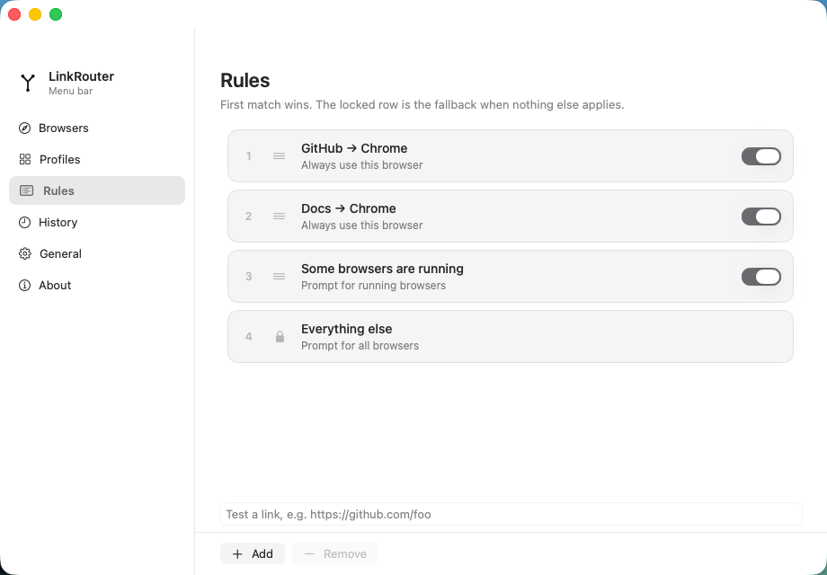
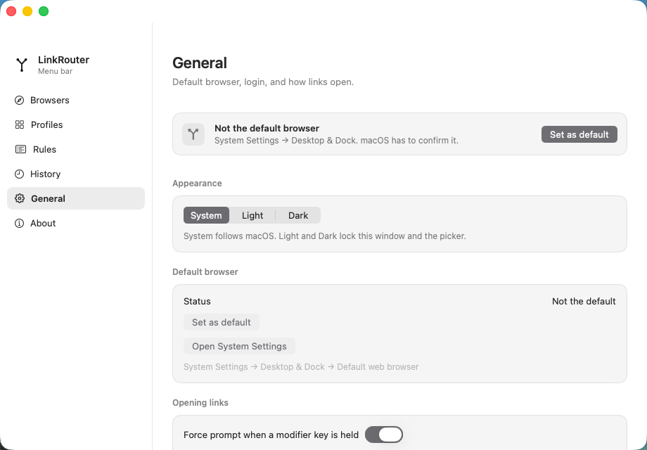
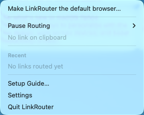

# LinkRouter

A native macOS menu-bar app that makes every link open in the right browser — or the right browser profile.

LinkRouter registers as your default HTTP(S) handler. When a link is opened, it either applies your first-match rules (URL patterns, running browsers, source app, time of day) or shows a compact picker at the pointer so you can choose a browser, a Chrome-family profile, a private window, or a Firefox profile — with one keystroke.

Not affiliated with browser-router — this is an independent app.

<picture>
  <source media="(prefers-color-scheme: dark)" srcset="demo/picker-dark.png">
  <source media="(prefers-color-scheme: light)" srcset="demo/picker-light.png">
  
</picture>

## Install

1. Download `LinkRouter-<version>.dmg` from the [latest release](https://github.com/henrikogaard/linkrouter/releases/latest) — signed with Developer ID and notarized by Apple.
2. Open the DMG and drag **LinkRouter** into **Applications**.
3. Launch it, click **Set as default**, and confirm in System Settings → Desktop & Dock → Default web browser.

Requires macOS 14 or later. Updates arrive in-app via Sparkle — no reinstall needed.

## What it does

- **Route by rules** — first-match rules on URL (glob/regex/contains), the link's source app, running-browser counts, link kind, and time windows. Send GitHub to Chrome, docs to your work profile, everything else to the favourite.
- **…or pick every time** — a floating picker appears at the pointer; keys 1–9, arrows, Return, Escape, or type to filter. Auto-dismiss after 15/30/60 s falls back to the favourite.
- **Profiles and private windows** — target a specific Chrome-family profile (Chrome, Canary, Beta, Brave, Edge, Vivaldi, Chromium, Arc) or Firefox profile, or open a private window directly (Edge uses `--inprivate`, others `--incognito`).
- **Link cleaning** — optionally unwraps known redirect links (Google `/url`, Outlook SafeLinks, Facebook `l.php`) and strips `utm_*` and common click-ID parameters (`fbclid`, `gclid`, …) before routing.
- **Menu-bar extra** — pause routing, route the clipboard link, check for updates, and reopen from a Recent list.
- **History** — a searchable list of the last 200 routed links with reopen, copy, and always-open-here actions.
- **Links in from anywhere** — Shortcuts intents (*Open Link with LinkRouter*, *Open Link in a Browser*), a Services menu entry (*Route Link with LinkRouter* on selected text), and clipboard routing.

## Screenshots

| Settings — Browsers | Settings — Rules | Settings — General |
| --- | --- | --- |
|  |  |  |

Menu bar:



## Browsers

Profile and private-window rows work for any installed Chromium-family browser — Chrome, Chrome Canary, Chrome Beta, Brave, Microsoft Edge, Vivaldi, Chromium, and Arc — plus Firefox.

The catalog only lists apps that declare the `http`/`https` URL schemes, so non-browser apps that merely *can* open a link don't clutter the list. Rows pointing at a deleted profile or uninstalled browser show a **Missing profile** / **Missing** badge and drop out of the picker; **Refresh** re-resolves them.

Not supported: Safari and Orion profiles, and Arc Spaces — they can't be targeted from outside the browser.

## Troubleshooting

- **State file**: `~/Library/Application Support/LinkRouter/state.json`. If the file can't be decoded, the original is kept next to it as `state.corrupt-*.json` and the app reseeds from Launch Services.
- **Logs**: `log stream --predicate 'subsystem == "app.linkrouter"'` (categories `app` and `routing`).
- **Browser moved or uninstalled**: the row shows **Missing** and its picker toggle is disabled. **Refresh** in the Browsers pane re-resolves rows by bundle identifier.
- **Profile deleted in the browser**: the row shows **Missing profile** and leaves the picker until the profile returns or the row is removed.

## Development

Requires Xcode 16 or later.

```sh
# Build
xcodebuild -project LinkRouter.xcodeproj -scheme LinkRouter \
  -destination 'platform=macOS' -derivedDataPath build \
  CODE_SIGN_IDENTITY="-" CODE_SIGNING_ALLOWED=NO build

# Test
xcodebuild -project LinkRouter.xcodeproj -scheme LinkRouter \
  -destination 'platform=macOS' -derivedDataPath build \
  CODE_SIGN_IDENTITY="-" CODE_SIGNING_ALLOWED=NO test
```

Or open `LinkRouter.xcodeproj` in Xcode and run. The built app is `build/Build/Products/Debug/LinkRouter.app`. Copy it to `/Applications` before making it the default browser, so Launch Services isn't talking to a translocated copy.

The Xcode project is maintained by hand — when adding a source file, register it in `project.pbxproj` (file reference, build file, group, Sources phase).

## Releases

Release tags use `vMAJOR.MINOR.PATCH` (e.g. `v1.0.0`) and must point to a commit reachable from `main` — the workflow rejects tags from unmerged branches. Tagging runs tests, archives a universal Apple Silicon + Intel build, signs with Developer ID and hardened runtime, notarizes and staples the app and its signed DMG, generates the signed Sparkle appcast, and attaches `LinkRouter-<version>.dmg`, `SHA256SUMS`, and `appcast.xml` to the GitHub Release. The app version comes from the tag; the build number is the workflow run number. No unsigned fallback is published.

One-time signing setup and required secrets/variables (`DEVELOPER_ID_P12`, `DEVELOPER_ID_P12_PASSWORD`, `APPSTORE_API_PRIVATE_KEY`, `APPLE_TEAM_ID`, `APPSTORE_API_KEY_ID`, `APPSTORE_ISSUER_ID`):

```sh
./scripts/setup-signing.sh
```

Use a **Developer ID Application** certificate and a **Team API key** — the workflow passes an issuer ID and doesn't support Individual API keys. Never commit certificate or key files.

## Updates

LinkRouter uses [Sparkle](https://sparkle-project.org) for in-app updates. The public EdDSA key is committed in the `SPARKLE_PUBLIC_ED_KEY` build setting and substituted into `SUPublicEDKey` in Info.plist, so update checks are enabled in every normal build.

Releases need the matching private key as the `SPARKLE_PRIVATE_ED_KEY` GitHub Actions secret. When set, the release workflow runs `generate_appcast` over `dist/` and attaches `appcast.xml`; the app's `SUFeedURL` is `releases/latest/download/appcast.xml`. If the pair is regenerated, update the build setting and the secret together — old builds can't verify a new pair.

## Preview and nightly builds

- **Preview** (`Actions → Preview → Run workflow`, or `gh workflow run preview.yml --ref <branch> -f version=1.0.0`): a signed, notarized DMG uploaded as a workflow artifact — it installs as **LinkRouter Preview.app** with its own bundle identifier (`app.linkrouter.LinkRouter.preview`), its own `~/Library/Application Support/LinkRouter Preview` state folder, and update checks disabled. Previews never overwrite a normal install, and since they ship as artifacts rather than GitHub Releases, they can never appear in the appcast. Artifact downloads always arrive zipped — for releases, use the bare DMG on the release page instead. Retained 14 days.
- **Nightly** (`Actions → Nightly`, or every night at 03:00 UTC): an ad-hoc-signed `LinkRouter-nightly-<sha>.zip` of `main`. macOS will warn; right-click → **Open** to run. Prefer tagged releases. Retained 14 days.

## License

MIT — see [LICENSE](LICENSE).

Like the app? You can [buy Henrik a coffee](https://buymeacoffee.com/henrikogaard).
